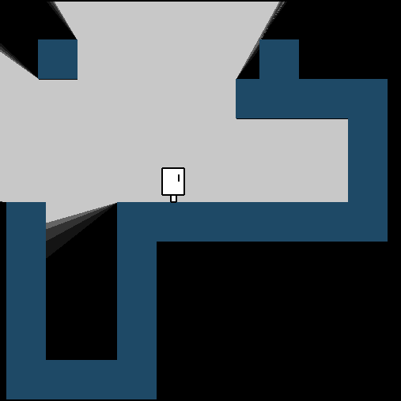

Lighter

Custom rougelike game engine (and maybe full game later on).



How to start developing:

1) Linux:
 - install make
 - install gcc
 - install SDL2 (neat installation guide can be found here: https://lazyfoo.net/tutorials/SDL/01_hello_SDL/index.php),

2) Windows:
 - All you need to know (and set) is in this video: https://www.youtube.com/watch?v=tmGBhM8AEj8https://www.youtube.com/watch?v=tmGBhM8AEj8

You can start developing!


 How to run:
 - compile using make command:
```
make lighter
```
 - run game by using command: 
```
./lighter
```

On Visual Studio Code use default compile & run options.
