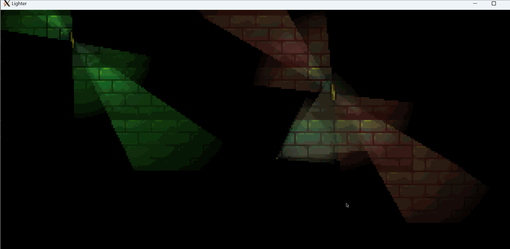

Lighter

Game written in C using SDL2 library.
It will contain awsome light effects and post-apocaliptic vibe.

Controls:

A - move left

D - move right

W - swipe light upwards

S - swip light downwards

Space - Jump

Q - cycle DEBUG functions

Current work progress:




How to contirbute:

Linux (tested on Ubuntu 18):

1) Ensure that you`ve got proper libraries installed:

```
sudo apt-get install libsdl2-dev libsdl2-image-2.0.0 
```

1a) Ensure you`ve got all compilation toolchain (gcc, make):

```
sudo apt install build-essential
```

2) In very rare case of not having all core package install it by using command:

```
sudo apt install libc6-dev libasound-dev libpthread-stubs0-dev libpulse-dev xorg libdrm-dev libgbm-dev
```

3) To compile use command:

```
make lighter
```

Windows: 

WIP
